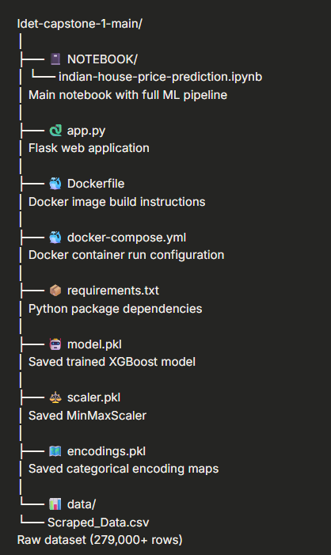

# 🏠 Indian House Price Prediction System

A machine learning web application that predicts house prices
across major Indian cities using XGBoost algorithm trained on
279,000+ real property listings.


---

## 📋 Table of Contents

- [Overview](#overview)
- [Features](#features)
- [Tech Stack](#tech-stack)
- [Project Structure](#project-structure)
- [Getting Started](#getting-started)
- [How It Works](#how-it-works)
- [Model Performance](#model-performance)
- [API Reference](#api-reference)
- [Docker Setup](#docker-setup)
- [Screenshots](#screenshots)
- [Limitations](#limitations)
- [Author](#author)

---

## 🎯 Overview

This project is an end-to-end machine learning system built
as part of the **IDET AI ML Capstone Project**.

### The Problem

Real estate prices in India vary enormously:

- 3 BHK flat in **Mumbai** → ₹1.5 Crore
- 3 BHK flat in **Patna** → ₹25 Lakhs

Buyers and sellers have no easy way to estimate a fair price.

### The Solution

A trained ML model that predicts fair market price based on:

- Location (city and locality)
- Property size (bedrooms, bathrooms, carpet area)
- Property type and furnishing
- Whether it is for rent or sale

---

## ✨ Features

- 💰 **Price Prediction** — Instant price estimate for any property
- 🔍 **Similar Properties** — Recommends comparable listings
- 🗺️ **Map Visualization** — View properties on interactive map
- 🌐 **Web Interface** — Easy-to-use HTML form
- 🐳 **Docker Ready** — Run anywhere with one command
- 📊 **98.2% Accuracy** — High performance XGBoost model

---

## 🛠️ Tech Stack

| Category      | Technology          | Version  |
| ------------- | ------------------- | -------- |
| Language      | Python              | 3.13.9   |
| ML Model      | XGBoost             | 2.x      |
| Data          | pandas, numpy       | 2.x, 1.x |
| Visualization | matplotlib, seaborn | 3.x, 0.x |
| Maps          | folium              | 0.x      |
| Web Framework | Flask               | 3.x      |
| Notebook      | Jupyter             | 7.x      |
| Container     | Docker + Compose    | latest   |

---

## 📁 Project Structure



---

## 🚀 Getting Started

### Prerequisites

Make sure you have these installed:

- Python 3.13.9
- pip 25.3+
- Docker Desktop (optional, for Docker method)

### Method 1 — Run the Notebook

```bash
# Step 1: Clone the repository
git clone https://github.com/yourusername/indian-house-price-prediction.git
cd indian-house-price-prediction

# Step 2: Install dependencies
pip install -r requirements.txt

# Step 3: Open notebook in VS Code
# Open: NOTEBOOK/indian-house-price-prediction.ipynb

# Step 4: Run all cells
# Kernel → Restart and Run All

Method 2 — Run the Web App
# Step 1: Install dependencies
pip install -r requirements.txt

# Step 2: Run the notebook first to generate model files
# (model.pkl, scaler.pkl, encodings.pkl)

# Step 3: Start Flask app
python app.py

# Step 4: Open browser
# Go to: http://localhost:5000

Method 3 — Run with Docker
# Step 1: Build the Docker image
docker-compose build

# Step 2: Run the container
docker-compose up

# Step 3: Open browser
# Go to: http://localhost:5000

# Step 4: Stop when done
docker-compose down
```
